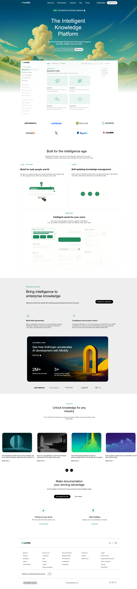

# 🚀 Mintlify Documentation Website Clone


A **pixel-inspired UI recreation of the Mintlify landing page**, built to practice **modern frontend layout techniques, visual hierarchy, and SaaS-style design systems**.

The goal of this project was to replicate the **structure, typography, and layout patterns** of the Mintlify website using **clean semantic HTML and modern CSS practices** such as **Flexbox and CSS Grid**.

---

# 🌐 Live Demo

🔗 **Live Website**  
https://mintlify-cloned.vercel.app/

📁 **GitHub Repository**  
https://github.com/Ashishjha013/mintlify-clone

---

# 📸 Project Preview



---

# 🎯 Project Objectives

The main objectives of this project were:

- Practice **real-world SaaS landing page recreation**
- Improve **layout structuring skills**
- Understand **visual hierarchy in UI design**
- Build consistent **spacing and typography systems**
- Learn modern **CSS layout techniques**

Focus areas included:

- UI composition
- Grid-based layouts
- Component-style section design
- Clean and readable code structure

---

# 🧰 Tech Stack

| Technology | Purpose |
|-----------|--------|
| HTML5 | Semantic page structure |
| CSS3 | Styling and layout |
| Flexbox | Horizontal alignment |
| CSS Grid | Section and card layouts |
| Inter Font | Modern SaaS typography |

---

# 🧱 Sections Implemented

The following sections from the **Mintlify landing page** were recreated.

---

## 1️⃣ Header / Navigation

Features:

- Brand logo
- Navigation links
- CTA buttons
- Clean horizontal layout

Navigation items include:

- Resources
- Documentation
- Customers
- Blog
- Pricing

---

## 2️⃣ Hero Section

The main landing section includes:

- Primary headline  
  **"The Intelligent Knowledge Platform"**

- Supporting description
- Primary CTA button
- Background illustration
- Center-aligned content layout

Design goal: **high visual impact and strong user focus.**

---

## 3️⃣ Quickstart / Documentation Preview

This section mimics the **Mintlify documentation interface**.

Includes:

- Sidebar navigation layout
- Documentation-style content
- Quickstart cards
- Two-column structure

Purpose: demonstrate a **developer-focused documentation UI**.

---

## 4️⃣ Trusted By / Partner Logos

Displays well-known company logos such as:

- Anthropic
- Coinbase
- Microsoft
- PayPal

Design characteristics:

- Horizontal logo alignment
- Muted grayscale appearance
- Balanced spacing

---

## 5️⃣ Features Section

Headline:

> **Built for the intelligence age**

Feature highlights include:

- Build for people and AI
- Self-updating knowledge management
- Intelligent documentation systems

Layout uses a **grid-based card structure**.

---

## 6️⃣ Assistant Preview Section

Simulated SaaS dashboard UI including:

- Assistant widgets
- Analytics cards
- Structured UI panels

Purpose: replicate **modern product dashboard interfaces**.

---

## 7️⃣ Enterprise Section

Enterprise-focused messaging including:

- Compliance features
- Access control highlights
- Enterprise-grade reliability

Includes a **dark-themed feature card with metrics**.

---

## 8️⃣ Industry Use Cases

Industry-specific card layout including:

- Image thumbnails
- Titles and short descriptions
- Carousel-style navigation indicators

---

## 9️⃣ Call-To-Action Section

Main message:

> **Make documentation your winning advantage**

Includes:

- Primary CTA button
- Secondary CTA button
- Center-focused layout

---

## 🔟 Footer

Multi-column footer including:

- Product links
- Resources
- Company links
- Legal information
- Brand identity
- System status indicator

---

# 🔤 Typography

Primary font used:

```
Inter
```

Font stack:

```css
font-family: "Inter", system-ui, -apple-system, BlinkMacSystemFont, sans-serif;
```

Why Inter?

- High readability
- Widely used in modern SaaS platforms
- Clean and professional appearance

---

# 🎨 Color System

## Primary Brand Colors

| Color | Usage |
|------|------|
| `#0F4C5C` | Hero gradient |
| `#0B7285` | Hero gradient |
| `#16A34A` | Primary CTA |

---

## Neutral Colors

| Color | Usage |
|------|------|
| `#0F172A` | Primary text |
| `#475569` | Secondary text |
| `#FFFFFF` | Background |
| `#F8FAFC` | Section background |
| `#E5E7EB` | Borders |

---

## Button Styling

### Primary Button

```
Background: #16A34A
Text: #FFFFFF
```

### Secondary Button

```
Background: #FFFFFF
Border: #D1D5DB
Text: #0F172A
```

---

# 🏗️ Project Structure

```
mintlify-clone
│
├── index.html
├── style.css
│
├── images/
├── icons/
├── logo/
├── video/
│
└── README.md
```

---

# ⚙️ Running the Project Locally

### 1️⃣ Clone the repository

```bash
git clone https://github.com/Ashishjha013/mintlify-clone.git
```

### 2️⃣ Navigate to the folder

```bash
cd mintlify-clone
```

### 3️⃣ Open in browser

Open:

```
index.html
```

Or run using **VS Code Live Server**.

---

# 📚 What I Learned

Through this project I improved my understanding of:

- Real-world **SaaS landing page design**
- Layout building using **Flexbox and Grid**
- Maintaining consistent **spacing systems**
- Structuring complex **multi-section UI**
- Writing cleaner **semantic HTML**

---

# 📌 Future Improvements

Possible enhancements include:

- Mobile responsiveness improvements
- Dark / light theme toggle
- Micro-interactions and animations
- Accessibility improvements
- React component-based version
